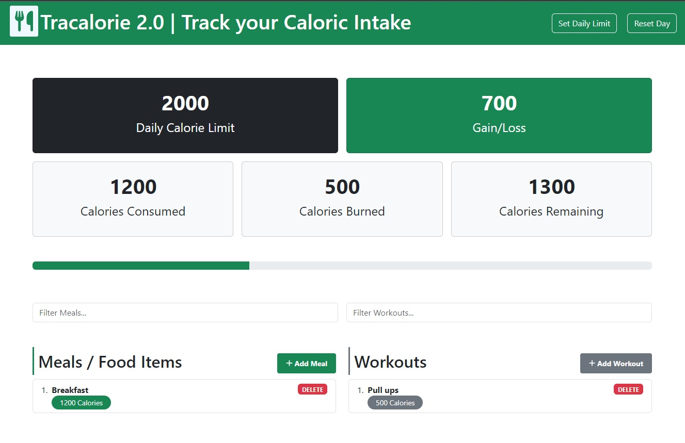

<div align="center">


# Anderson Toledo Martins Moreira

[](https://docs.google.com/document/d/1I8T4Mkb61NsTKN14ZbT1mnQKAc9LqiiPtgrYf9ayH1c/edit?usp=sharing)
[](https://docs.google.com/document/d/1vnFlRP3myxexgHk5Y6XaCKQGETPQwCygPZqGSblwCXg/edit?usp=sharing)
<br/>
[](https://www.linkedin.com/in/atmmoreira)
[](mailto:atmmoreira.rj@gmail.com?subject=From%20GitHub&cc=atmmoreira.rj@gmail&body=Hi,%20there.%20Found%20you%20from%20GitHub.)
[](https://api.whatsapp.com/send?phone=5521992890362)

</div>

<div align="center">


</div>

## Descriptions

Project created with JavaScript Vanilla, with the goals to improve skills in Object-oriented programming (OOP). App to track calories, meals and workouts. CRUD using localStorage with Webpack, JavaScript Vanilla, HTML5, CSS3 and Bootstrap. See the [DEMO](https://tracalories-javascript.vercel.app/)

## Images and Descriptions of Screens

- HomePage  
  
- Diagram  
  

## Technologies

<!--
References for Create budgets :: https://shields.io/category/build
Icons: https://simpleicons.org/
-->


### Frameworks and Libraries


### Tools


## Running the project

```bash
# Download or clone the repository.

# Open the project inside your favorite:
I use Visual Studio Code

# To install dependencies of this project, type in the terminal:
`npm install`

# To run this project, type in the terminal:
`npm run dev`

# In your favorite Browser, open this URL, to see the Interface.
http://localhost:3000/
```
