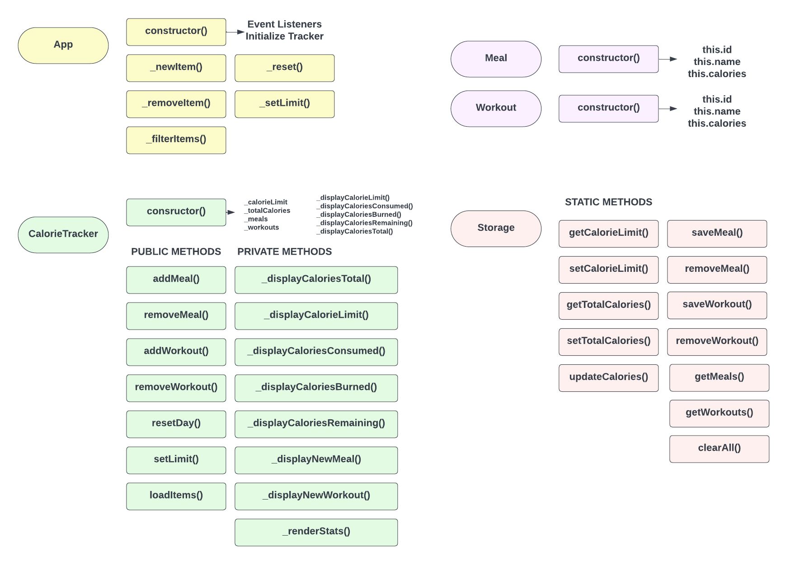

<div align="center">
  
  <h1>Anderson Toledo Martins Moreira</h1>
  <a href="http://www.atmm.dev" target="_blank">Portfolio Online</a>

> Software Developer that love learn and improve your skills in programming languages like CSS (SASS, Bootstrap, TailwindCSS) | JavaScript | React (Next.js) | Typescript | Node (Nest.js) | PHP (Laravel | WordPress), and I started learning about Python and Data Science.

</div>
<br >
<!-- References for Create budgets :: https://shields.io/category/build -->
<div align="center">
  <!--  -->
  
  
  <!--  -->
  
  
  <!-- 
  
  
  
  
  
  
   -->
</div>

## Description
Project created with JavaScript Vanilla, with the goals to improve skills in Object-oriented programming (OOP). App to track calories, meals and workouts. CRUD using localStorage with Webpack, JavaScript Vanilla, HTML5, CSS3 and Bootstrap. See the [DEMO](https://tracalories-javascript.vercel.app/)

## Layout and Project Diagram

<div align="center">
  
</div>

<br>

### Project Diagram

<div align="center">
  
</div>

<br>

## Programming Languages and Frameworks.
```Bash
# Bootstrap 5.3.1
# HTML5 / CSS3 / SASS
# Javascript
# OOP
```

## System Requirements
```Bash
# Git
# Node
```

## Installing and run the project

```bash
# Step 01 
# Download or clone the repository. 

# Step 02 
# Open the project inside your favorite IDE (I use VSCode). 

# Step 03 
# Type in the terminal: 'npm i', to install dependencies.

# Step 04
# Type in the terminal: 'npm run dev', to compile the project, and wait to appear in the browser.

```
